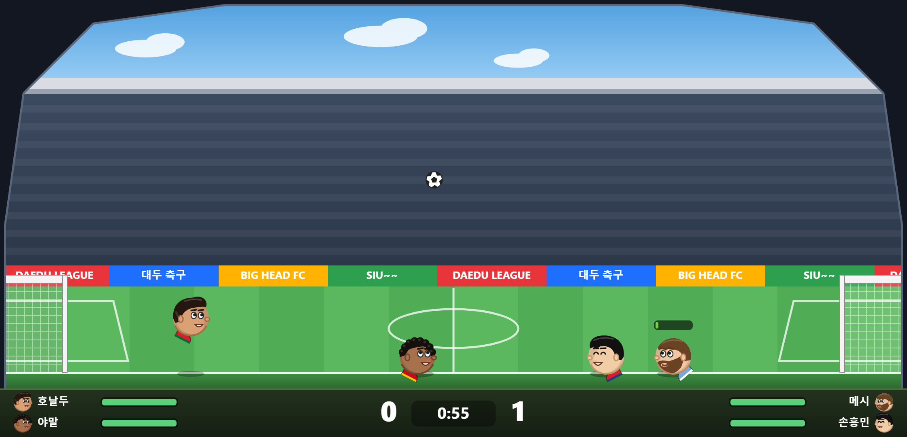
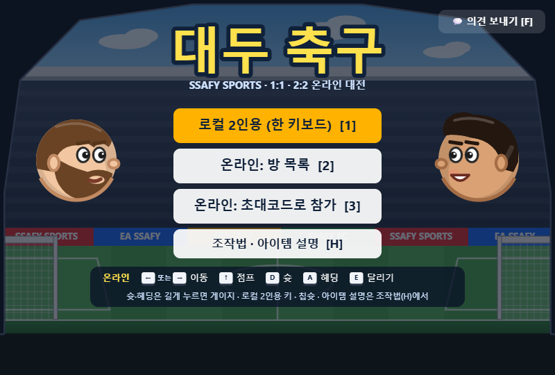
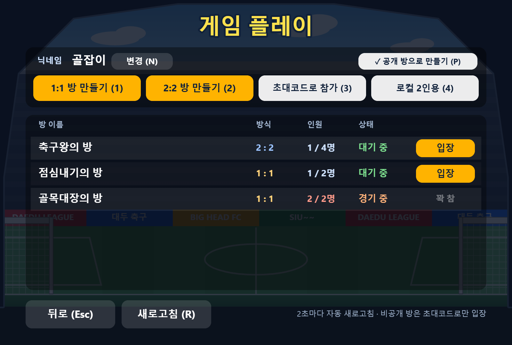
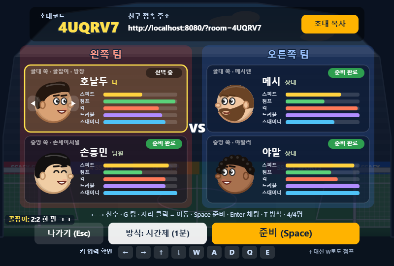
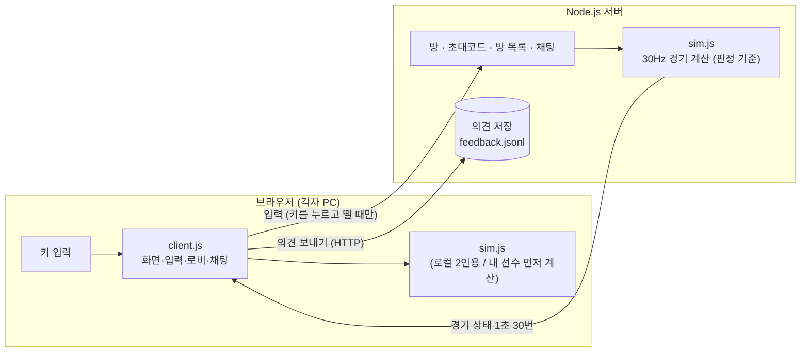

# ⚽ 대두 축구 · SSAFY SPORTS

> 머리 큰 선수들이 **1:1 · 2:2로 겨루는 브라우저 헤드 사커**
> Flash 게임 *Sports Heads: Football* 의 조작감을 직접 분석해 재현하고, 온라인 대전·2:2·방 목록·채팅을 더한 개인 프로젝트입니다.

  

  
  
  
  
  
  
  
  

<b>🎮 플레이하기 → <a href="http://13.209.89.203">http://13.209.89.203</a></b> 개인 서버(AWS EC2 프리티어)에서 운영 중 · HTTP 접속 · 서버 사정에 따라 주소가 바뀌거나 내려갈 수 있어요

> 소스 코드는 비공개 저장소에서 관리합니다. 이 저장소는 프로젝트 소개용입니다.

---

## 주요 기능

| 구분 | 내용 |
|---|---|
| 모드 | 로컬 2인용(한 키보드) · **온라인 1:1 · 2:2** · 혼자 연습 |
| 온라인 | 방 목록(2초마다 갱신) · 공개/비공개 방 · 초대 링크 · 닉네임 · 끊기면 일시정지 후 같은 코드로 복귀 |
| 2:2 | 로비에서 자리 클릭으로 팀 이동·자리 맞바꿈 · 넓은 운동장(800 → 1120px) · 내 선수 ▼ 표시 |
| 소통 | 로비·경기 중 **채팅**(Enter) · 메인 화면 **의견 보내기**(버그·건의·후기) |
| 플레이 | 게이지 슛(차올랐다 내려가는 게이지) · 칩슛 · 땅볼슛 · 방향 조준 헤딩 · 달리기(체력) · 아이템 18종 |
| 선수 | 선수 10명, 능력치 5종(스피드·점프·킥·드리블·스태미너) · 그림 파일 없이 코드로 그린 캐리커처 얼굴 |

  
  

  

---

## 구조

브라우저와 서버가 **같은 게임 로직 파일(`sim.js`)** 을 씁니다. 로컬 2인용은 브라우저 안에서, 온라인은 서버에서 같은 코드가 돌아갑니다.

| 파일 | 역할 |
|---|---|
| `sim.js` | 물리·규칙. 맨 위 `TUNING` 하나에서 속도·슛·헤딩·체력·아이템 수치를 모두 조정 |
| `client.js` | Canvas 렌더링, 입력, 사운드(WebAudio 합성), 메뉴·로비·채팅·의견 창 |
| `server.js` | 정적 파일, 방/초대코드/방 목록, WebSocket 동기화, 의견 저장 |

---

## 해결한 문제들

### 1. 원작 조작감을 "느낌"이 아니라 수치로 맞추기
처음엔 손으로 맞춘 수치라 이동이 빙판처럼 미끄럽고 점프 높이도 달랐습니다.
그래서 원작 SWF 안의 AS3 바이트코드(AVM2)를 읽는 **디스어셈블러를 Node로 직접 만들어** 원작 로직을 확인했습니다.

- 물리: Box2D 2.0.2, 1px = 1단위, 중력 300, **30fps에 1/96초씩 3번** 계산
- 이동: 매 프레임 `속도 += 50 + 30·속도아이템`, 그다음 `× 0.7` (아이템 기본값이 0이 아니라 1이라는 점을 놓쳐 처음엔 속도를 잘못 계산했음)
- 점프: `-150 - 50·점프아이템` → 기본 -200
- 다리: 머리 중심에 매단 40×10 막대를 모터로 돌리는 진자 구조

같은 수치를 [planck.js](https://github.com/piqnt/planck.js)(Box2D JS 포팅)에 그대로 옮겼습니다. 속도·점프 높이·슛 세기를 원작 값과 숫자로 대조한 뒤에 그 위에 게이지 슛·헤딩·달리기 같은 기능을 얹었습니다.

### 2. 온라인에서 끊김 줄이기
서버가 판정하고 30Hz로 상태를 보내는 구조인데, 와이파이에서는 상태가 몰려 오거나 늦게 와서 화면이 끊겼습니다.

- **지터 버퍼**: 받은 상태를 1~3틱 정도 모아 두고 도착 시각이 아니라 **서버 틱 번호 기준**으로 일정하게 재생. 도착 간격이 흔들릴수록 버퍼를 자동으로 늘림
- **내 선수는 내 PC에서 먼저 계산**: 키 입력이 바로 반영되도록 내 선수만 브라우저에서 같은 공식으로 움직이고, 서버 결과와 어긋난 만큼 매 틱 15%씩 당겨 맞춤. 60px 넘게 어긋나면(충돌·골·리셋) 서버 위치로 즉시 맞춤
- F4로 새 방식과 이전 방식을 바로 비교할 수 있게 해 두고 친구와 직접 플레이하며 확인

### 3. Windows에서 서버 틱이 흔들리던 문제
`setInterval(33ms)` 로 돌리면 Windows 타이머가 **약 15.6ms 단위로만 깨어나서** 틱 간격이 30~47ms로 흔들렸습니다.
다음 틱 17ms 전까지는 `setTimeout`으로 쉬고, 남은 시간만 `setImmediate`로 기다리는 방식으로 바꿔 간격을 33ms에 맞췄습니다.

공개 서버(AWS EC2 + nginx + HTTPS)에서 브라우저 1개 + 테스트 클라이언트 3개로 2:2를 돌리며 잰 값: **핑 약 10ms, 상태 도착 간격 평균 33.4ms(최대 41ms)**
지금 운영 중인 개인 서버(EC2 프리티어)로 옮긴 뒤 잰 핑: **중간값 7.5ms** (20회, 최소 5.9 · 최대 14.8ms)

### 4. 2:2로 늘리면서 생긴 것들
- 게임 로직 곳곳의 "선수는 2명, 상대는 1명" 전제를 걷어내고 선수 배열·팀(side) 기준으로 변경 (머리 밟고 점프는 팀원 포함 모든 선수, "상대 얼리기" 아이템은 상대 팀 전원)
- 4명이 서기엔 좁아서 2:2만 운동장 폭을 1120px로 넓히고, 화면 비율·배경·벽·골대를 폭에 맞춰 다시 생성
- 로비 자리 맞바꾸기 때 두 연결의 자리 번호를 함께 갱신, 방장이 나가면 남은 사람에게 방장 넘김

### 5. 공개 서버에 올리며 챙긴 것
- 정적 파일 **허용 목록**: 게임 파일 4개만 공개하고 나머지 경로는 모두 404 (서버 코드·원작 파일 노출 방지)
- 첫 서버: nginx `/ws` 에 WebSocket Upgrade 설정 + HTTPS. 지금 서버(메모리 1GB 프리티어): Docker 컨테이너 하나가 80번을 직접 받음 (메모리 256MB 제한, 실사용 약 27MB, 재부팅 시 자동 시작)
- 채팅(80자, 5초에 5개)·의견 보내기(1분에 3개) 도배 제한, 의견 목록은 비밀키가 있어야 열림, 사용자 입력은 모두 이스케이프

---

## 조작

| 동작 | 온라인 | 로컬 P1 | 로컬 P2 |
|---|---|---|---|
| 이동 | ← → | A D | ← → |
| 점프 | ↑ / W | W | ↑ |
| 슛 (길게 = 게이지) | D | Space | P |
| 칩슛 / 땅볼슛 | Q + D / ↓ + D | Q / S + Space | O / ↓ + P |
| 헤딩 (길게 = 게이지, 방향키로 조준) | A | R | K |
| 달리기 | E + 방향키 | E | L |
| 채팅 | Enter | – | – |

---

원작: *Sports Heads: Football* (Flash). 이 프로젝트는 공부용 재구현이며 원작의 그림·소리·SWF 파일은 포함하지 않습니다. 선수 얼굴은 모두 코드로 그린 캐리커처입니다.
