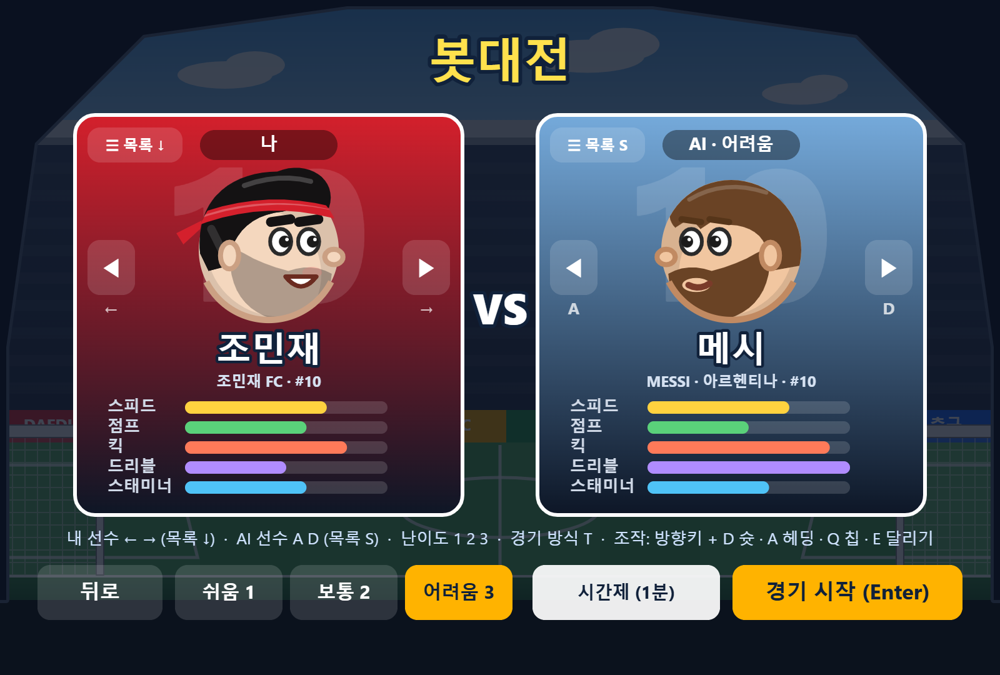
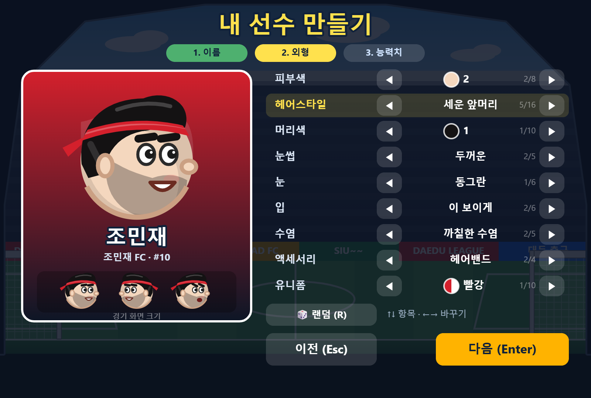
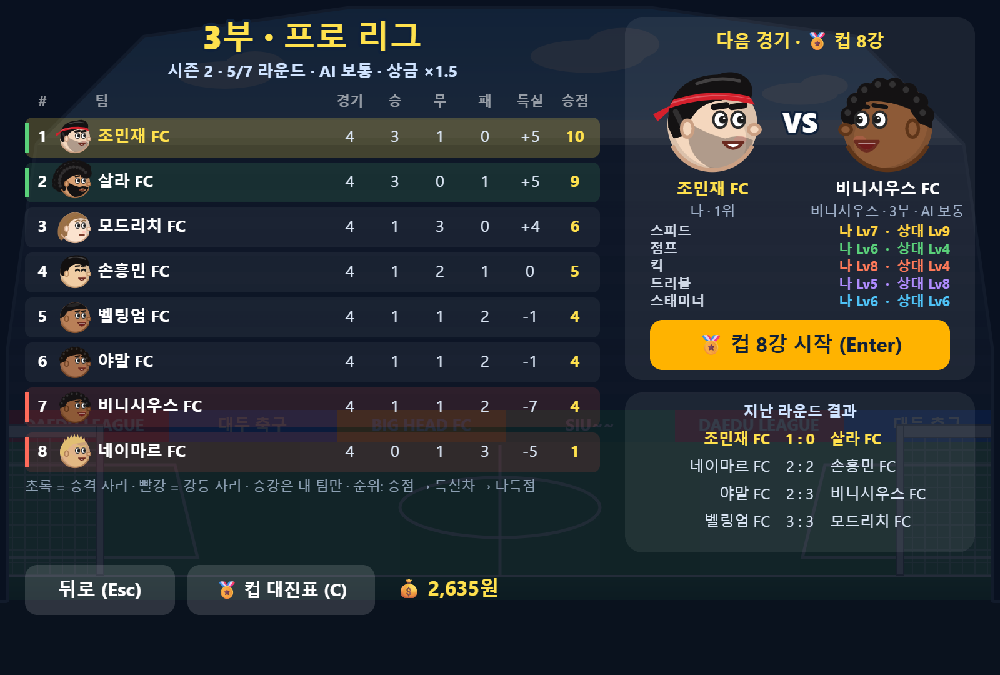
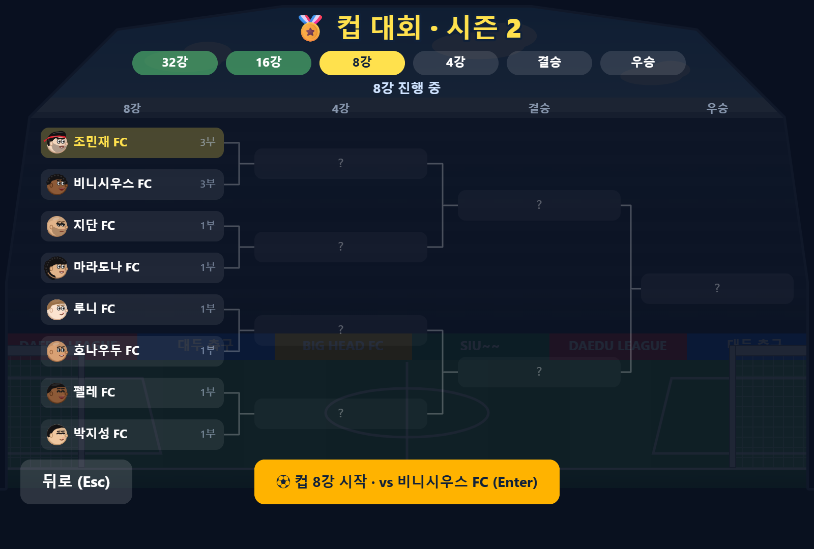
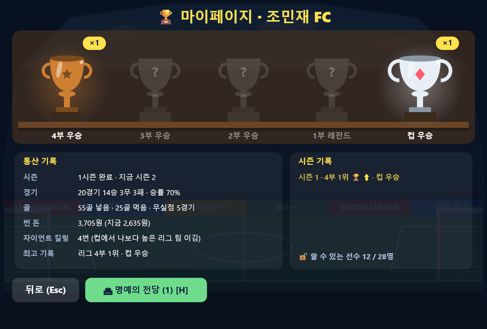
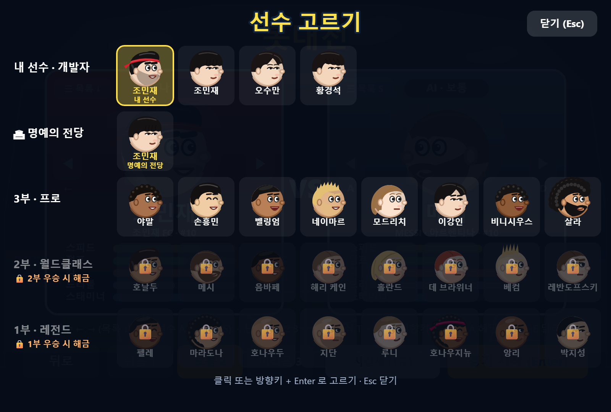
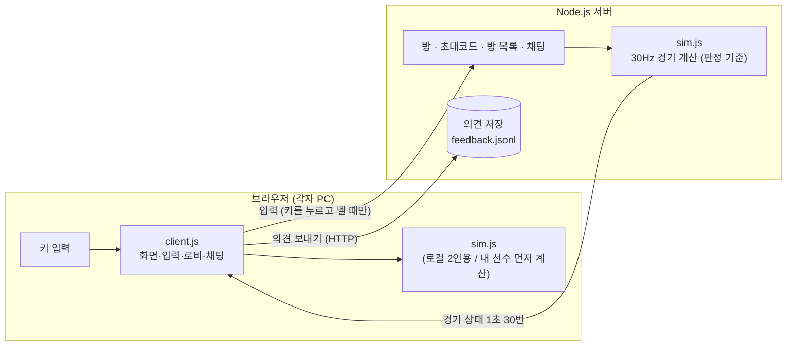
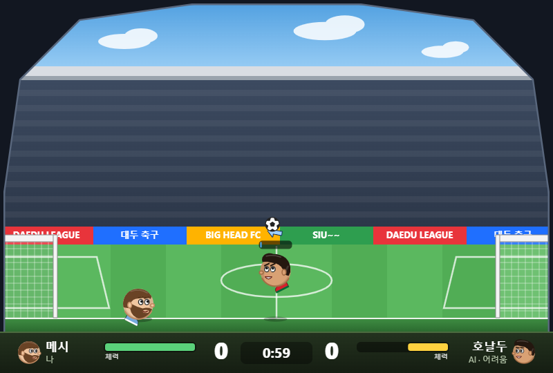

# ⚽ 대두 축구 · DAEDU LEAGUE

> 머리 큰 선수들이 **1:1 · 2:2로 겨루는 브라우저 헤드 사커**
> Flash 게임 *Sports Heads: Football* 의 조작감을 직접 분석해 재현하고, 온라인 대전·2:2·방 목록·채팅에 **내 선수를 만들어 키우는 커리어 모드(리그·컵)** 까지 더한 개인 프로젝트입니다.

<p align="center">
  
</p>

<p align="center">
  
  
  
  
  
  
  
  
</p>

<p align="center"><b>🎮 플레이하기 → <a href="http://13.209.89.203">http://13.209.89.203</a></b><br/><sub>개인 서버(AWS EC2 프리티어)에서 운영 중 · HTTP 접속 · 서버 사정에 따라 주소가 바뀌거나 내려갈 수 있어요</sub></p>

> 소스 코드는 비공개 저장소에서 관리합니다. 이 저장소는 프로젝트 소개용입니다.

---

## 주요 기능

| 구분 | 내용 |
|---|---|
| 모드 | 로컬 2인용(한 키보드) · **온라인 1:1 · 2:2** · **커리어(리그 · 컵)** · 봇대전(AI 대전, 난이도 3단계) · 혼자 연습 |
| 커리어 | **내 선수 만들기**(얼굴 부품 9종 조합) → 4부 동네 리그에서 1부 레전드 리그까지 승격 · 32강 컵 · 상금으로 능력치 성장 · 트로피 장식장 · 명예의 전당 |
| 온라인 | 방 목록(2초마다 갱신) · 공개/비공개 방 · 초대 링크 · 닉네임 · 끊기면 일시정지 후 같은 코드로 복귀 |
| 2:2 | 로비에서 자리 클릭으로 팀 이동·자리 맞바꿈 · 넓은 운동장(800 → 1120px) · 내 선수 ▼ 표시 |
| 기기 | PC(키보드) · **모바일(터치 버튼, 가로 화면)** · 홈 화면에 추가하면 앱처럼 전체 화면 |
| 소통 | 로비·경기 중 **채팅**(Enter) · 메인 화면 **의견 보내기**(버그·건의·후기) |
| 플레이 | 게이지 슛(차올랐다 내려가는 게이지) · 칩슛 · 땅볼슛 · 방향 조준 헤딩 · 달리기(체력) · 아이템 18종 |
| 선수 | 선수 27명 + **내가 만든 선수**(온라인에서도 사용), 능력치 5종(스피드·점프·킥·드리블·스태미너, Lv1~10) · 그림 파일 없이 코드로 그린 캐리커처 얼굴 · 2부 · 1부 선수는 커리어에서 그 리그 우승 시 해금 |

<p align="center">
  
  
</p>
<p align="center">
  
  
</p>

---

## 🏆 커리어 모드

내 선수를 만들어 **4부 동네 리그에서 시작해 1부 레전드 리그까지** 올라가는 성장 모드입니다.

<p align="center">
  
  
</p>
<p align="center">
  
  
</p>

| 단계 | 내용 |
|---|---|
| **내 선수 만들기** | 이름 → 외형(피부 8 · 헤어 16 · 머리색 10 · 눈썹 5 · 눈 6 · 입 6 · 수염 5 · 액세서리 4 · 유니폼 10, 🎲 랜덤) → 능력치(모두 Lv3 + 자유 포인트 5). 팀 이름은 자동으로 `이름 FC` |
| **리그 (4부 × 8팀)** | 4부 동네 조기축구회 → 3부 프로(손흥민 · 야말 · 살라 …) → 2부 월드클래스(메시 · 호날두 · 음바페 …) → 1부 레전드(펠레 · 마라도나 · 지단 · 박지성 …). 한 시즌 7경기, 2위 안 승격 · 7 · 8위 강등 (승강은 내 팀만, 리그 구성은 고정) |
| **컵 (32강 토너먼트)** | 32팀 전부 랜덤 추첨, 리그 경기 사이사이에 열림. 상대 리그 수준에 맞춰 AI 난이도가 바뀌고, 높은 리그 팀을 잡으면 **자이언트 킬링 ×1.5** 보너스 |
| **성장** | 리그 · 컵에서 번 상금(리그가 높을수록 배율 ↑)으로 능력치 상점에서 Lv10 까지. 능력치 초기화(쓴 돈 절반 환불) |
| **기록** | 마이페이지 트로피 장식장(4부 동 · 3부 은 · 2부 금 · 1부 레전드 · 컵) · 통산 기록 · 시즌 기록 |
| **명예의 전당** | 1부 우승 후 은퇴 → 그 선수는 영구 저장되어 봇대전 · 온라인 · 연습에서 계속 사용, 새 선수로 다시 4부부터 (돈 · 해금 유지) |
| **공정성** | 리그 · 컵은 "다시 하기" 없이 "계속"만, 경기 도중 나가거나 창을 닫으면 0:3 기권패 |

<p align="center">
  
</p>

---

## 구조

브라우저와 서버가 **같은 게임 로직 파일(`sim.js`)** 을 씁니다. 로컬 2인용은 브라우저 안에서, 온라인은 서버에서 같은 코드가 돌아갑니다.



| 파일 | 역할 |
|---|---|
| `sim.js` | 물리·규칙. 맨 위 `TUNING` 하나에서 속도·슛·헤딩·체력·아이템 수치를 모두 조정 |
| `client.js` | Canvas 렌더링, 입력, 사운드(WebAudio 합성), 메뉴·로비·채팅·의견 창 |
| `server.js` | 정적 파일, 방/초대코드/방 목록, WebSocket 동기화, 의견 저장 |
| `career.js` | 커리어 모드: 얼굴 부품 시스템, 내 선수 만들기, 리그 · 컵 · 상점 · 마이페이지 · 명예의 전당, 선수 목록 창 |

---

## 해결한 문제들

### 1. 원작 조작감을 "느낌"이 아니라 수치로 맞추기
처음엔 손으로 맞춘 수치라 이동이 빙판처럼 미끄럽고 점프 높이도 달랐습니다.
그래서 원작 SWF 안의 AS3 바이트코드(AVM2)를 읽는 **디스어셈블러를 Node로 직접 만들어** 원작 로직을 확인했습니다.

- 물리: Box2D 2.0.2, 1px = 1단위, 중력 300, **30fps에 1/96초씩 3번** 계산
- 이동: 매 프레임 `속도 += 50 + 30·속도아이템`, 그다음 `× 0.7` (아이템 기본값이 0이 아니라 1이라는 점을 놓쳐 처음엔 속도를 잘못 계산했음)
- 점프: `-150 - 50·점프아이템` → 기본 -200
- 다리: 머리 중심에 매단 40×10 막대를 모터로 돌리는 진자 구조

같은 수치를 [planck.js](https://github.com/piqnt/planck.js)(Box2D JS 포팅)에 그대로 옮겼습니다. 속도·점프 높이·슛 세기를 원작 값과 숫자로 대조한 뒤에 그 위에 게이지 슛·헤딩·달리기 같은 기능을 얹었습니다.

### 2. 온라인에서 끊김 줄이기
서버가 판정하고 30Hz로 상태를 보내는 구조인데, 와이파이에서는 상태가 몰려 오거나 늦게 와서 화면이 끊겼습니다.

- **지터 버퍼**: 받은 상태를 1~3틱 정도 모아 두고 도착 시각이 아니라 **서버 틱 번호 기준**으로 일정하게 재생. 도착 간격이 흔들릴수록 버퍼를 자동으로 늘림
- **내 선수는 내 PC에서 먼저 계산**: 키 입력이 바로 반영되도록 내 선수만 브라우저에서 같은 공식으로 움직이고, 서버 결과와 어긋난 만큼 매 틱 15%씩 당겨 맞춤. 60px 넘게 어긋나면(충돌·골·리셋) 서버 위치로 즉시 맞춤
- F4로 새 방식과 이전 방식을 바로 비교할 수 있게 해 두고 친구와 직접 플레이하며 확인

### 3. Windows에서 서버 틱이 흔들리던 문제
`setInterval(33ms)` 로 돌리면 Windows 타이머가 **약 15.6ms 단위로만 깨어나서** 틱 간격이 30~47ms로 흔들렸습니다.
다음 틱 17ms 전까지는 `setTimeout`으로 쉬고, 남은 시간만 `setImmediate`로 기다리는 방식으로 바꿔 간격을 33ms에 맞췄습니다.

공개 서버(AWS EC2 + nginx + HTTPS)에서 브라우저 1개 + 테스트 클라이언트 3개로 2:2를 돌리며 잰 값: **핑 약 10ms, 상태 도착 간격 평균 33.4ms(최대 41ms)**
지금 운영 중인 개인 서버(EC2 프리티어)로 옮긴 뒤 잰 핑: **중간값 7.5ms** (20회, 최소 5.9 · 최대 14.8ms)

### 4. 2:2로 늘리면서 생긴 것들
- 게임 로직 곳곳의 "선수는 2명, 상대는 1명" 전제를 걷어내고 선수 배열·팀(side) 기준으로 변경 (머리 밟고 점프는 팀원 포함 모든 선수, "상대 얼리기" 아이템은 상대 팀 전원)
- 4명이 서기엔 좁아서 2:2만 운동장 폭을 1120px로 넓히고, 화면 비율·배경·벽·골대를 폭에 맞춰 다시 생성
- 로비 자리 맞바꾸기 때 두 연결의 자리 번호를 함께 갱신, 방장이 나가면 남은 사람에게 방장 넘김

### 5. 공개 서버에 올리며 챙긴 것
- 정적 파일 **허용 목록**: 게임 파일 4개만 공개하고 나머지 경로는 모두 404 (서버 코드·원작 파일 노출 방지)
- 첫 서버: nginx `/ws` 에 WebSocket Upgrade 설정 + HTTPS. 지금 서버(메모리 1GB 프리티어): Docker 컨테이너 하나가 80번을 직접 받음 (메모리 256MB 제한, 실사용 약 27MB, 재부팅 시 자동 시작)
- 채팅(80자, 5초에 5개)·의견 보내기(1분에 3개) 도배 제한, 의견 목록은 비밀키가 있어야 열림, 사용자 입력은 모두 이스케이프

### 6. AI 대전: "그럴듯하게"가 아니라 "타이밍을 계산해서" 잘하게
원작 SWF의 AI(공 따라가기·점프·킥 몇 가지 규칙)를 뼈대로 시작했지만, 사람과 붙여 보니 슛·헤딩 반응이 느리고 단순했습니다.
AI는 **사람과 똑같은 키 입력**(좌우·점프·슛 게이지·헤딩·달리기)을 만들어 내는 방식이라 능력치·체력·아이템 규칙이 사람과 같고, 개선은 모두 **물리를 먼저 재고, 숫자로 확인**하는 순서로 했습니다.

<p align="center">
  
</p>

1. **슛을 전혀 못 막던 문제**: 슛 120개를 쏘는 테스트에서 AI 실점률이 **가만히 서 있는 것(27%)과 똑같았습니다.** 공만 따라다니고 날아오는 슛을 읽지 못했던 것.
   → 공이 내 자리를 지날 때의 **높이를 궤적으로 계산**해 버티기 / 타이밍 점프 / 뒤로 뛰기 / 헤딩 걷어내기로 대응 → **실점률 8%**
2. **헛발질**: 직접 재 보니 슛 키를 놓은 뒤 **4~6프레임 뒤에** 발이 닿고, 닿는 범위는 공이 18~44px 앞·땅에서 30px 이하. "닿을 거리에서 놓기"를 하면 그 사이 몸이 공을 먼저 밀어 버림.
   → 공 34px 앞에 멈춰 게이지를 모으고 **4~5프레임 뒤 발에 닿을 위치일 때 미리 놓기**
3. **골키퍼에 막히는 슛**: 슛 직전에 일반·땅볼·칩슛의 궤적을 계산해 **상대 머리 위로 넘고 크로스바 아래로 들어가는 종류·세기**를 고름 → 슛 드릴 골 40 → **50**/60
4. **헤딩을 거의 못 맞히던 문제**: 헤딩 게이지를 모으는 중에 공이 닿아도 헤딩이 된다는 점을 이용해, **점프 최고점 시각 = 공이 머리 높이에 오는 시각**이 되게 뛰고 뜨자마자 게이지 → 헤딩 성공 14 → **60**/60
5. **달리기**: 공 다툼·수비 복귀·공격 진행에 달리기를 쓰고 상황별로 체력을 남김. "아껴서 안 지치게" 버전은 오히려 약해져서(20승 20패), 위험할 때는 다 쓰고 나머지는 아끼는 버전을 채택
6. **무리하게 달라붙는 문제** (사람과 해 본 피드백): 상대와 나의 "공까지 도착 시간"을 비교해, 상대가 먼저 닿아 공격할 수 있으면 **공과 골대 사이 선 위로 물러나 수비**. 고치다 보니 상대가 **몰고 오는 공을 슛으로 착각해 제자리에 서 버리는** 버그도 발견 → 상대가 공 바로 뒤에 있으면 슛으로 보지 않게 수정. 공을 몰고 오는 장면에서 AI와의 거리 67 → **143px**, 1.5초 뒤 AI 위치가 골대 입구 앞으로

7. **공중볼 경합에서 늘 지던 문제**: 공을 옆에서 날려 보내고 "공 바로 밑으로 정확히 달려가는" 테스트 봇과 붙여 보니, 질 때 AI가 **아예 점프를 안 했습니다.** "이 높이에서 맞히자"는 계획이 가로로 걸어갈 시간까지 더해져 매 프레임 미뤄졌던 것.
   → 경합이면 **"지금 뛰면 머리가 공에 닿나"를 매 프레임 직접 계산**해 바로 뛰고, 공 바로 밑을 먼저 차지. 상대가 확실히 먼저 닿으면(점프 능력치 차이 등) 뛰지 않고 세컨드볼 자리로 → 경합 승률 어려움 25~34% → **36~44%**, 보통 35~45% → **39~48%**

| 난이도 | 구현 | AI끼리 결과 |
|---|---|---|
| 쉬움 | 공 따라가기 + 슛 궤적 읽고 막기 | – |
| 보통 | + 슛·헤딩 타이밍 계산 + 골키퍼를 넘는 슛 선택 + 골대 앞 수비 | vs 쉬움 **39승 1패** (40판) |
| 어려움 | + 적극적인 달리기·체력 관리 | vs 보통 **69승 51패** (120판, 진영·선수 번갈아) |

### 7. 모바일 지원: 게임 로직은 그대로, 버튼이 "키를 누른다"
키보드 전용 게임을 폰에서도 하게 만들면서 **물리·서버 코드는 한 줄도 바꾸지 않았습니다.** 화면 버튼이 눌리면 내부적으로 해당 키(←, →, D …)를 누른 것과 똑같이 처리하는 `touch.js` 하나만 추가해서, 온라인·AI 대전·연습이 모두 그대로 동작합니다.

```
┌─────────────────────────────────────────────────┐
│ [⏸][⛶]                                [헤딩]    │
│            (게임 화면 · 1:1 이면 양옆이           │
│             폰 화면 여백이라 버튼이 안 가림)  [점프] │
│ [ ◀ | ▶ ]                              [ 슛 ]   │
└─────────────────────────────────────────────────┘
```

- **이동**: ◀ ▶ 한 덩어리 버튼. 손가락을 떼지 않고 미끄러뜨려 방향 전환. **같은 방향을 짧게 톡 → 다시 누르고 있으면 달리기**, 떼면 멈춤 (첫 탭이 길게 누른 것이면 더블탭으로 치지 않아 방향만 다시 잡다 달려 버리는 일 방지)
- **슛**: 누르는 동안 게이지, 누른 채 **위로 밀면 칩슛 · 아래로 밀면 땅볼**
- **헤딩**: 누르는 동안 게이지, **미는 방향으로 조준**(↑ ↗ → ↘ ↓). 조준 키는 헤딩을 놓는 순간까지 눌려 있어야 방향이 반영되는 게임 규칙이 있어서, 손을 뗀 뒤 0.15초 늦게 조준 키를 떼도록 처리
- **화면**: 세로면 "가로로 돌려주세요", 확대·스크롤·더블탭 확대 막기, 주소창 높이 변화 대응(`dvh`). 요즘 폰은 가로 비율이 게임보다 길어서 1:1 은 양옆 여백에 버튼을 두고, 2:2(넓은 운동장)는 작고 반투명하게 모서리에
- **전체 화면**: 안드로이드는 첫 터치 때 자동 전체 화면 + 가로 고정. 아이폰은 크롬까지 모두 WebKit 이라 웹페이지 전체 화면이 막혀 있어서 **홈 화면에 추가** 안내를 띄우고, 웹 앱 manifest·아이콘을 넣어 홈 화면 아이콘으로 열면 주소창 없이 꽉 차게
- 터치 기기에서만 켜지고(PC 는 그대로), PC 에서 시험할 땐 `?touch=1`

### 8. 커리어 모드: 그림 파일 없이 "얼굴 부품"으로
- 기존 선수 10명은 선수마다 머리 모양을 손으로 그린 함수였는데, 커스텀을 위해 **부품 조합형 얼굴**(머리 · 눈 · 눈썹 · 입 · 수염 · 액세서리)을 만들고 기존 머리 모양도 부품으로 재사용. 새 선수 17명도 부품 번호만 골라서 추가
- 리그의 다른 경기는 실제로 돌리지 않고 **능력치 평균 차이로 기대 골 수를 정해 푸아송 분포로 점수**를 뽑음. 컵의 다른 경기는 더 높은 리그 팀이 이기고 같은 리그면 랜덤
- **온라인에서 내 선수**: 내 선수의 이름 · 외형 번호 · 능력치 레벨을 서버가 범위 검사(능력치 1~10 등)한 뒤 방 사람들에게 전달하고, 각 브라우저가 외형 번호로 얼굴을 그림. 조작된 값(능력치 99 등)은 거절하고 기본 선수로
- 저장은 브라우저(localStorage). 예전 버전 저장도 새 규칙(리그 구성 고정 등)에 맞게 자동으로 정리

### 9. 능력치가 "체감"되게 + 그러다 찾은 물리 버그
레벨별로 실제 속도 · 높이를 재 보니 점프만 티가 나고 **킥은 Lv1 → Lv10 이 슛 속도 +12%** 뿐이었습니다. 그런데 슛을 그냥 빠르게 하면 같은 각도에서 **더 높이 · 멀리** 날아가 칩슛이 하늘로 솟는 문제가 생겼습니다.
- **같은 길을 다른 빠르기로**: 공 속도 ×k, 그 공의 중력 ×k² → 포물선(높이 · 도착 지점)은 그대로, 도착 시간만 1/k. Lv1 ×0.75 ~ Lv10 ×1.25 (같은 슛 도착 0.84초 ↔ 0.50초). AI 의 궤적 예측도 그 공의 중력 배율을 반영
- **칩슛이 땅에서 너무 높게 튀던 버그**: 땅에 닿는 순간 중력은 원래대로 돌아가는데 속도는 빠른 채로 튀어서 원래보다 2배 넘게 튐 → 닿는 순간 속도도 같은 배율로 되돌려 첫 바운드 101px → **47px**
- **땅볼슛이 공중으로 날아가던 버그**: 드리블 중 공이 10~20px만 떠 있어도 거의 수평(−4°)이라 170~190px를 날아간 뒤에야 떨어짐 → 차는 순간 바닥으로 내려 바로 굴림
- 스피드 · 스태미너는 "만렙은 그대로, 하한을 내려" 격차를 키우고(걷기 135 ↔ 260px/s), 점프는 반대로 하한을 올려 격차를 줄임

---

## 조작

| 동작 | 온라인 · 봇대전 · 커리어 | 로컬 P1 | 로컬 P2 | 모바일 (터치) |
|---|---|---|---|---|
| 이동 | ← → | A D | ← → | ◀ ▶ (미끄러뜨려 전환) |
| 점프 | ↑ / W | W | ↑ | 점프 |
| 슛 (길게 = 게이지) | D | Space | P | 슛 누르고 있기 |
| 칩슛 / 땅볼슛 | Q + D / ↓ + D | Q / S + Space | O / ↓ + P | 슛 누른 채 위로 / 아래로 밀기 |
| 헤딩 (길게 = 게이지, 조준) | A + 방향키 | R | K | 헤딩 누른 채 조준 방향으로 밀기 |
| 달리기 | E + 방향키 | E | L | ◀ 또는 ▶ 톡 → 다시 누르고 있기 |
| 채팅 · 일시정지 | Enter · Esc | – · Esc | – · Esc | 💬 · ⏸ |

---

<sub>원작: *Sports Heads: Football* (Flash). 이 프로젝트는 공부용 재구현이며 원작의 그림·소리·SWF 파일은 포함하지 않습니다. 선수 얼굴은 모두 코드로 그린 캐리커처입니다. 실존 선수 이름은 팬 메이드 캐리커처로만 사용했습니다.</sub>
